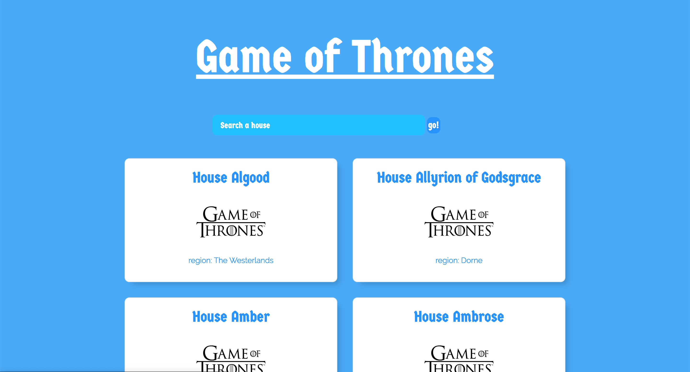

# Opdrachten Week 2

Minor Web Development - Performance Matters

## Hoe mijn app was:

[styling](https://github.com/MonikaaS/performance-matters-1819/tree/master/performance-matters-ss/basis)

## Opdrachten

1. [Optimaliseer de first meaningful paint][opdracht1]
2. [Optimaliseer de Time to first byte][opdracht2]

### Opdracht 1: Optimaliseer de first meaningful paint

Ik ben dit gaan aanpassen, omdat het als gebruiker belangrijk is om iets te zien te krijgen, wanneer de pagina aan het laden is.

Ik heb dit gedaan door eerst mijn fonts te optimaliseren met: [font-display](https://www.google.com](https://css-tricks.com/google-fonts-and-font-display/)

daarna ben ik met inline styling de belangrijkste styling gaan aanroepen.

screenshotjes per optimalisatie:
[fonts](https://github.com/MonikaaS/performance-matters-1819/tree/master/performance-matters-ss/fonts)
[styling](https://github.com/MonikaaS/performance-matters-1819/tree/master/performance-matters-ss/first-meaningfull-paint)

#### Resources

### Opdracht 2: Optimaliseer de time to first byte

Om de pagina sneller te laten laden, wilde ik de times to first byte gaan optimaliseren.

Ik ben als eerste begonnen met gzip, zodat bepaalde files gecompressed worden.
Dit zijn de verbeteringen:
[gzip](https://github.com/MonikaaS/performance-matters-1819/tree/master/performance-matters-ss/gzip-compression)

Daarna wilde ik graag met minify mijn bestanden gaan minify'en en in een dist folder stoppen. Zodat mijn server daarop draait. Maar ik heb het geprobeerd, maar het lukte me niet. Ik weet niet zo goed waar ik moet beginnen.

#### Resources

<!-- Bindings -->

[opdracht1]: https://github.com/cmda-minor-web/performance-matters-1819/blob/master/week-2.md#opdracht-1-optimaliseer-de-first-meaningful-paint
[opdracht2]: https://github.com/cmda-minor-web/performance-matters-1819/blob/master/week-2.md#opdracht-2-optimaliseer-de-perceived-performance
